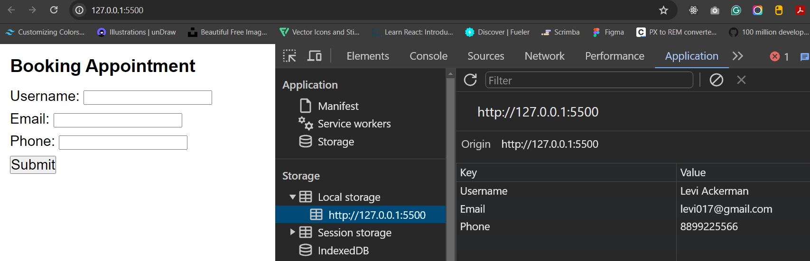

## Booking Appointment App

Now, let us build a Booking Appointment App.

Deliverables:

1. In the html file create a form with 3 input fields: one for collecting username, second for collecting email, and third for collecting phone number.

2. Make sure you use label tag for each of these input fields.

3. The form should have a button of submit type.

4. On form submission collect the user details mentioned above and then store them in the browser's local storage.

Note:

Input elements should be given “name” attribute with values:
“username” for Username input
“email” for Email input, and
“phone” for Phone input
While storing data in the local storage the key for storing:
Username Input should be "Username"
Email Input should be "Email"
Phone Input should be "Phone"

Output:

